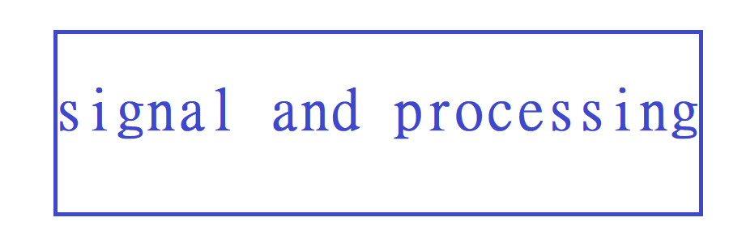

# Signal and Processing

some signal process code

# 栏目导航/navigation

| introduction/介绍         | link/链接                                                    | etc                               |
| ------------------------- | ------------------------------------------------------------ | --------------------------------- |
|                           | [Communication Signal Analysis](https://github.com/glingi/CommunicationSignalAnalysis) | author：glingi                    |
| modulation classification | [modulation recognition](https://github.com/isaaccorley/pytorch-modulation-recognition) | pytorch  RadioML2016 Dataset |
|                           |                                                              |                                   |

# library & reference

| content                                 | link                                                         | language |
| --------------------------------------- | ------------------------------------------------------------ | -------- |
| Matab libray Alpha stable distributions | [Alpha stable distribution](https://github.com/markveillette/stbl) | Matab    |
| python Alpha-Stable distributions       | [Alpha stable distribution](https://github.com/aavanian/pyStable) | python   |
|                                         |                                                              |          |

# paper&code

| paper                                                        | code                                                         | 语言   |
| ------------------------------------------------------------ | ------------------------------------------------------------ | ------ |
| [Blind Source Separation Using Mixtures of Alpha-Stable Distributions](https://ieeexplore.ieee.org/document/8462095) or [paper link](https://arxiv.org/pdf/1711.04460.pdf) | [Alpha stable blind source separation](https://github.com/nkeriven/alpha_stable_bss) | MATLAB |
|                                                              |                                                              |        |
|                                                              |                                                              |        |
|                                                              |                                                              |        |

